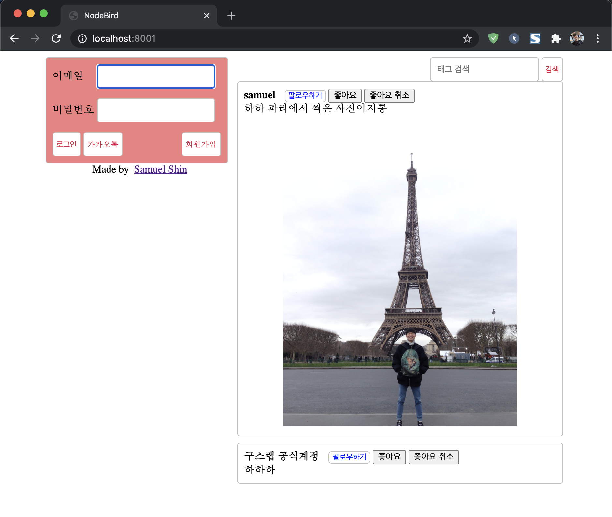
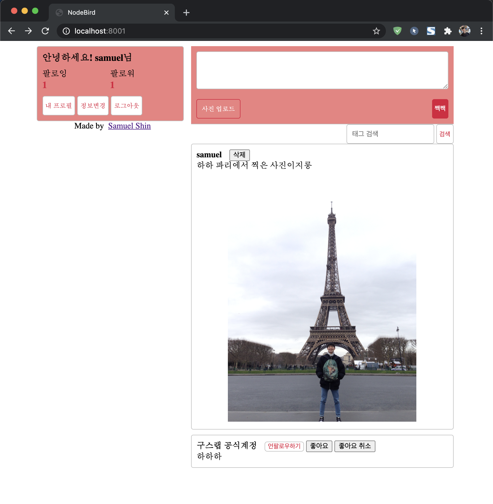

# 나름 복잡한 SNS

카카오 로그인, 그냥 로그인, 이미지 업로드, 게시글 작성, 해시태그 검색, 팔로잉 기능이 있는 SNS 서비스
MySQL을 wrapping 하는 sequalize 모듈을 이용한다.

/models: MySQL 코드들
/routes: express.Router 코드들
/view: nunjucks로 작성된 프론트엔도 html 코드들
/passport: passport module을 이용해서 로그인 구현한 부분

실행 명령어  
$ npm install  
$ npm run build:parser    // 웹팩 모듈을 이용해서 /src/index.js 를 /public/bundle.js 로 변환한다!  
$ npm start  

